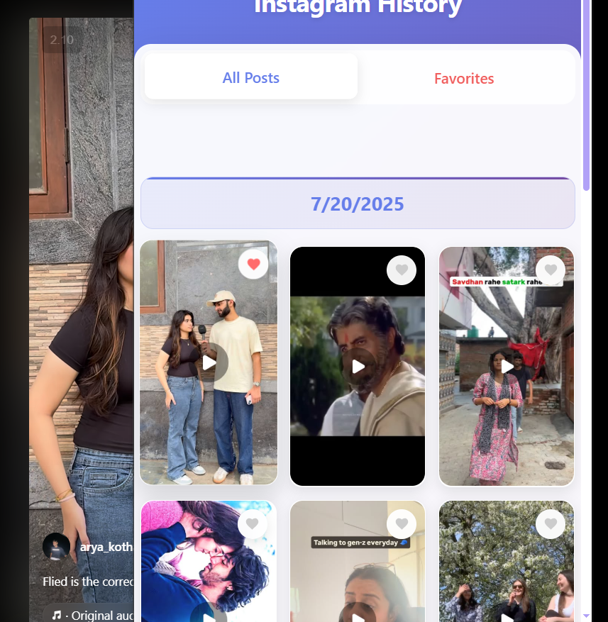

# 📸 Instagram History Extension

A modern browser extension that automatically tracks and saves Instagram posts you visit, providing a beautiful interface to browse your viewing history with favorites support.



## ✨ Features

- **🔄 Automatic Tracking**: Seamlessly tracks Instagram posts as you browse
- **💾 Persistent Storage**: Uses IndexedDB for reliable local storage
- **⭐ Favorites System**: Mark and filter your favorite posts
- **📅 Date Grouping**: Organizes posts by date for easy browsing
- **🎨 Modern UI**: Beautiful, responsive interface with smooth animations
- **📱 Responsive Design**: Works perfectly on different screen sizes
- **🔍 Search & Filter**: Easy navigation through your history
- **⚡ Fast Performance**: Optimized with Web Workers for smooth operation

## 🚀 Installation

### For Users

1. **Download the Extension**
   - Clone this repository or download the ZIP file
   - Extract to a folder on your computer

2. **Install in Browser**
   - **Chrome/Edge**: 
     - Open `chrome://extensions/`
     - Enable "Developer mode"
     - Click "Load unpacked"
     - Select the extension folder
   - **Firefox**:
     - Open `about:debugging`
     - Click "This Firefox"
     - Click "Load Temporary Add-on"
     - Select `manifest.json`

3. **Start Using**
   - Visit Instagram and browse posts
   - Click the extension icon to view your history
   - Use the "All Posts" and "Favorites" tabs to navigate

### For Developers

```bash
# Clone the repository
git clone git@github.com:GauravScripts/Instagram-History-Extension.git
cd instagram-history-extension

# Install dependencies
npm install

# Build the extension
npm run build

# For development with watch mode
npm run dev
```

## 🛠️ Development

### Project Structure

```
Instagram-History-Extension/
├── background.js          # Service worker for background tasks
├── content.js            # Content script for Instagram page interaction
├── popup.html           # Extension popup interface
├── popup.js             # Popup functionality and UI logic
├── indexedDB.js         # Database operations and storage
├── worker.js            # Web Worker for data processing
├── webpack.config.js    # Build configuration
├── package.json         # Dependencies and scripts
└── manifest.json        # Extension manifest
```

### Key Technologies

- **JavaScript ES6+**: Modern JavaScript features
- **IndexedDB**: Local database storage
- **Web Workers**: Background data processing
- **Webpack**: Module bundling and optimization
- **CSS3**: Modern styling with animations
- **HTML5**: Semantic markup

### Build Commands

```bash
# Development build with watch mode
npm run dev

# Production build
npm run build

# Clean build directory
npm run clean
```

## 🎯 How It Works

### 1. **Content Detection**
- Monitors Instagram pages for post URLs
- Extracts post thumbnails and metadata
- Captures timestamps automatically

### 2. **Data Storage**
- Uses IndexedDB for persistent storage
- Implements efficient data structures
- Handles large datasets gracefully

### 3. **User Interface**
- Modern, responsive popup interface
- Tabbed navigation (All Posts / Favorites)
- Pagination for large datasets
- Smooth animations and transitions

### 4. **Data Processing**
- Web Workers for background processing
- Date-based grouping of posts
- Duplicate detection and removal
- Efficient search and filtering

## 🎨 UI Features

### Modern Design Elements
- **Gradient Backgrounds**: Beautiful purple-blue gradients
- **Glass Morphism**: Translucent cards with backdrop blur
- **Smooth Animations**: CSS transitions and transforms
- **Responsive Layout**: Adapts to different screen sizes
- **Custom Scrollbars**: Modern, subtle scrollbar styling

### Interactive Elements
- **Hover Effects**: Visual feedback on interactions
- **Loading States**: Smooth loading animations
- **Empty States**: Helpful messages when no data exists
- **Confirmation Dialogs**: Safe deletion with confirmations

## 📊 Data Management

### Storage Structure
```javascript
{
  id: "unique_id",
  url: "instagram_post_url",
  thumbnail: "image_url",
  timestamp: "2024-01-01T12:00:00Z",
  favorite: false
}
```

### Features
- **Automatic Deduplication**: Prevents duplicate entries
- **Date Grouping**: Organizes by visit date
- **Favorites System**: Mark important posts
- **Bulk Operations**: Clear all history at once

## 🔧 Configuration

### Manifest Settings
- **Permissions**: `tabs`, `storage`
- **Host Permissions**: `*://*.instagram.com/*`
- **Content Scripts**: Automatic injection on Instagram pages

### Build Configuration
- **Webpack**: Optimized for extension development
- **Babel**: ES6+ transpilation
- **Minification**: Production-ready builds

## 🚨 Privacy & Security

### Data Handling
- **Local Storage Only**: No data sent to external servers
- **User Control**: Complete control over stored data
- **Clear History**: Easy data removal option
- **No Tracking**: No analytics or user tracking

### Permissions
- **Minimal Access**: Only Instagram pages
- **Local Storage**: No network requests
- **User Consent**: Clear permission requests

## 🐛 Troubleshooting

### Common Issues

**Extension not working on Instagram**
- Ensure the extension is enabled
- Check if Instagram is in the allowed sites
- Refresh the Instagram page

**History not saving**
- Check browser storage permissions
- Clear browser cache and reload
- Verify IndexedDB is available

**UI not loading properly**
- Rebuild the extension: `npm run build`
- Check browser console for errors
- Update to latest version

### Debug Mode
```bash
# Enable debug logging
npm run dev
# Check browser console for detailed logs
```

## 🤝 Contributing

We welcome contributions! Here's how to help:

1. **Fork the repository**
2. **Create a feature branch**: `git checkout -b feature/amazing-feature`
3. **Make your changes**
4. **Test thoroughly**
5. **Submit a pull request**

### Development Guidelines
- Follow existing code style
- Add comments for complex logic
- Test on multiple browsers
- Update documentation as needed

## 📝 License

This project is licensed under the MIT License - see the [LICENSE](LICENSE) file for details.

## 🙏 Acknowledgments

- **Instagram**: For providing the platform
- **Web Extension Community**: For inspiration and tools
- **Open Source Contributors**: For various libraries and tools

## 📞 Support

- **Issues**: [GitHub Issues](https://github.com/GauravScripts/instagram-history-extension/issues)
- **Discussions**: [GitHub Discussions](https://github.com/GauravScripts/instagram-history-extension/discussions)
- **Email**: your-email@example.com

---

<div align="center">
  <p>Made with ❤️ for Instagram users</p>
  <p>⭐ Star this repo if you find it useful!</p>
</div>