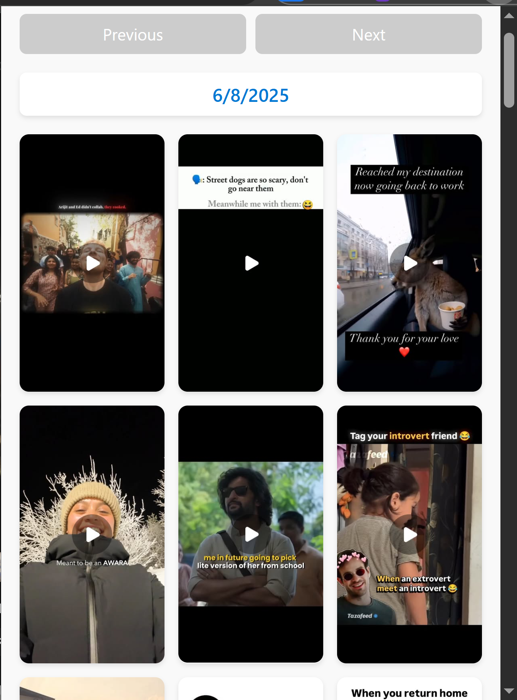

# Instagram History Extension
# Instagram History Extension

A browser extension that tracks your visited Instagram URLs, saves them with timestamps and thumbnails using IndexedDB, and provides a history of your Instagram browsing.

## Features

- Automatically tracks every Instagram URL you visit in your browser.
- Extracts and saves a thumbnail image for each visited Instagram page.
- Stores history data locally using IndexedDB for privacy and performance.
- Easy to clear your Instagram visit history.

## How It Works

- The extension listens for tab updates and detects when you visit an Instagram URL.
- It fetches the page, extracts a thumbnail (using Open Graph, Twitter Card, or Instagram's internal data), and saves the URL, timestamp, and thumbnail to IndexedDB.
- You can later view or clear your Instagram visit history.

## Technologies Used

- JavaScript (ES6+)
- IndexedDB (for local storage)
- Browser Extension APIs (compatible with Chrome and Firefox)
- npm (for dependency management)

## Installation

1. **Clone the repository:**
2. **Install dependencies:**
3. **Load the extension in your browser:**
   - For Chrome:
     1. Go to `chrome://extensions/`
     2. Enable "Developer mode"
     3. Click "Load unpacked" and select the project directory
   - For Firefox:
     1. Go to `about:debugging#/runtime/this-firefox`
     2. Click "Load Temporary Add-on" and select the `manifest.json` file

## Usage

- Browse Instagram as usual.
- The extension will automatically track and save your visited Instagram URLs.
- (Optional) Use the extension popup or options page (if implemented) to view or clear your history.

## Project Structure

- `background.js` — Listens for Instagram URL visits, extracts thumbnails, and saves data.
- `indexedDB.js` — Handles all IndexedDB operations (add, get, clear).
- `content.js` — (If needed) Handles content script logic.
- `manifest.json` — Extension manifest file.
- `README.md` — Project documentation.

## Development

- Make changes to the JavaScript files as needed.
- Reload the extension in your browser after making changes.
- Use the browser console for debugging.

## Contributing

Pull requests and issues are welcome! Please open an issue to discuss your ideas or report bugs.

## License

This project is licensed under the MIT License.